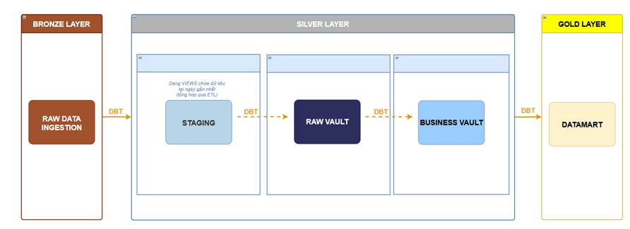

# dbt Capstone - Data Vault 2.0 tren BigQuery

Project xay dung pipeline mo hinh du lieu theo chuan **Data Vault 2.0** bang `dbt` tren `Google BigQuery` cho bo du lieu Instacart.

## Project Overview

```text
Raw (BigQuery) -> Staging (View) -> Raw Vault (Hub / Link / Satellite) -> Marts (Dim / Fact)
```



## Architecture

| Layer | Schema BigQuery | Materialization | Mo ta |
|---|---|---|---|
| **Staging** | `stg_instacart` | view | Chuan hoa du lieu raw, tinh hash key va load timestamp |
| **Raw Vault** | `raw_vault` | table | Hub, Link, Satellite theo Data Vault 2.0 |
| **Marts** | `marts` | table | Dimension va Fact table phuc vu phan tich |

## Technology

- `dbt Core`
- `dbt-bigquery`
- `Google BigQuery`
- SQL + Jinja2 macro
- `Kestra` (orchestration)


## Data Sources

Source `raw_instacart` trong `models/sources.yml`, dataset `dbt_dev_toni` tren BigQuery:

| Bang | Mo ta |
|---|---|
| `aisles` | Danh muc quay hang |
| `departments` | Danh muc nganh hang |
| `orders` | Don hang cua khach hang |
| `order_products_prior` | Chi tiet san pham trong don prior |
| `order_products_train` | Chi tiet san pham trong don train |
| `products` | Thong tin san pham |

## Documentation

- [dbt Core](https://docs.getdbt.com/docs/introduction?version=1.12)
- [Data Vault 2.0](https://datafinder.ru/files/downloads/01/Building-a-Scalable-Data-Warehouse-with-Data-Vault-2.0.pdf)
