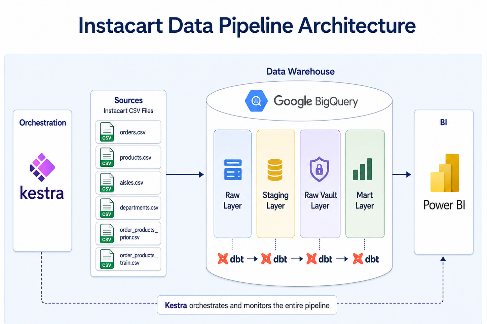

# THIẾT KẾ VÀ XÂY DỰNG HỆ THỐNG DATA PIPELINE CHO DỮ LIỆU BÁN LẺ CỦA INSTACART

Project xây dựng pipeline theo chuẩn **Data Vault 2.0** bằng `dbt` trên `Google BigQuery` cho bộ dữ liệu Instacart

## Project Overview

## Architecture

| Layer | Schema BigQuery | Materialization | Mô tả |
|---|---|---|---|
| **Staging** | `stg_instacart` | view | Chuẩn hóa dữ liệu raw, tính hashkey và load timestamp  |
| **Raw Vault** | `raw_vault` | table | Hub, Link, Satellite theo Data Vault 2.0 |
| **Marts** | `marts` | table | Dimension, Fact table và Mart cho Power BI phục vụ phân tích và trực quan hóa |

## Technology

- `dbt Core`
- `dbt-bigquery`
- `Google BigQuery`
- SQL + Jinja2 macro
- `Kestra` (orchestration)

## Documentation

- [dbt Core](https://docs.getdbt.com/docs/introduction?version=1.12)
- [Data Vault 2.0](https://datafinder.ru/files/downloads/01/Building-a-Scalable-Data-Warehouse-with-Data-Vault-2.0.pdf)
