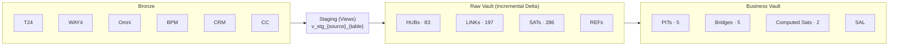
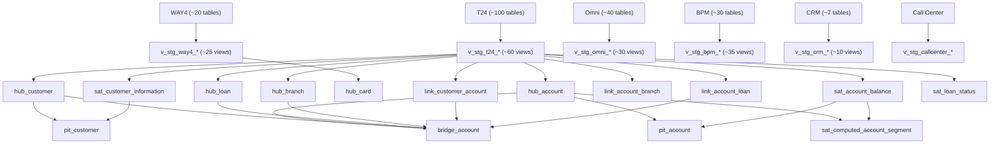

# OCB Data Vault 2.0 — dbt on Databricks

> **Project**: `datavaultmodel2` · **Org**: OCB (Ocean Commercial Bank)  
> **Stack**: dbt Core · Databricks (Unity Catalog) · Delta Lake · GitLab CI/CD

---

## 1. Project Overview

Data Warehouse chuẩn **Data Vault 2.0** cho OCB, tích hợp 6 hệ thống nguồn:

| Source | Domain |
|---|---|
| T24 | Core Banking (tài khoản, khoản vay, tiền gửi) |
| WAY4 | Cards (thẻ, giao dịch, billing) |
| Omni | Digital Banking (người dùng, thanh toán) |
| BPM | Workflow nghiệp vụ, hồ sơ, bảo hiểm |
| CRM | Lịch sử liên hệ khách hàng |
| Call Center | Log cuộc gọi |

---

## 2. Architecture Diagram



| Layer | Materialization | Mục đích |
|---|---|---|
| Staging | `view` | Cast types, generate hash keys & hashdiff |
| Hub | `incremental (merge)` | Business keys — 1 row/entity, không update |
| Link | `incremental (merge)` | Quan hệ giữa các entities |
| Satellite | `incremental (merge)` | Thuộc tính theo thời gian (CDC via hashdiff) |
| PIT / Bridge | `incremental (merge)` | Snapshot & multi-hop join phục vụ reporting |

---

## 3. Prerequisites

**Cài đặt:**

```bash
pip install dbt-databricks
pip install databricks-cli
```

**Quyền truy cập cần thiết:**

| Resource | Quyền |
|---|---|
| Databricks Workspace | SQL Warehouse, Unity Catalog |
| Bronze DB (`ocb_datavault_{env}_sourcing`) | `SELECT` |
| Raw Vault DB (`ocb_datavault_{env}_cleaned`) | `CREATE TABLE`, `INSERT`, `SELECT` |
| Service Principal | OAuth `client_id` + `client_secret` (hỏi infra team) |
| GitLab | Developer role |

**Biến môi trường** (mỗi env dùng bộ riêng — credentials lấy từ GitLab CI/CD Variables):

```bash
export DATABRICKS_HOST="https://<workspace>.azuredatabricks.net"
export DATABRICKS_SQL_WAREHOUSE_HTTP_PATH="/sql/1.0/warehouses/<id>"
export DATABRICKS_CLIENT_ID="<client-id>"
export DATABRICKS_CLIENT_SECRET="<client-secret>"
export DATABRICKS_DESTINATION_CATALOG="ocb_datavault_{dev|pilotcloud|prod}_cleaned"
export DATABRICKS_DESTINATION_SCHEMA="raw_vault"
```

---

## 4. Setup Guide

```bash
# 1. Clone & install
git clone <repository-url> && cd datavault-model
pip install -r requirements.txt

# 2. Kiểm tra kết nối
dbt debug

# 3. Chạy pipeline (daily)
dbt run --vars '{"target_date": "20250415", "run_mode": "daily"}' --target dev

# Chạy theo source
dbt run --select tag:t24 --vars '{"target_date": "20250415", "run_mode": "daily"}'

# Chạy theo layer
dbt run --select raw_vault.*
dbt run --select business_vault.*
```

`profiles.yml` đọc credentials từ env vars, có sẵn trong repo với `auth_type: oauth` cho cả 3 targets: `dev`, `pilotcloud`, `prod`.

```bash
# Chạy với target cụ thể
dbt run --target pilotcloud --vars '{"target_date": "20250415"}'
```

---

## 5. Backfill Guide

Mỗi model dùng `target_date` (format: `YYYYMMDD`) để lọc theo ngày. Incremental merge đảm bảo idempotent — chạy lại cùng ngày vẫn an toàn.

```bash
# Backfill 1 ngày
dbt run --vars '{"target_date": "20250101", "run_mode": "backfill"}' --target dev

# Backfill range (shell loop)
for d in $(python3 -c "
from datetime import date, timedelta
d = date(2025,1,1)
while d <= date(2025,1,31):
    print(d.strftime('%Y%m%d')); d += timedelta(1)"); do
  dbt run --select tag:t24 --vars "{\"target_date\": \"$d\", \"run_mode\": \"backfill\"}"
done
```

**Production**: dùng Databricks Job (`resources/`) với `for_each_task` để chạy song song theo ngày:

```bash
databricks bundle deploy --target dev
databricks jobs run-now --job-id <job_id> \
  --job-parameters '{"start_date": "2025-01-01", "end_date": "2025-01-31", "run_mode": "backfill"}'
```

---

## 6. Troubleshooting

| Lỗi | Nguyên nhân | Cách fix |
|---|---|---|
| `PermissionDenied` | Sai credentials hoặc token hết hạn | Kiểm tra `DATABRICKS_CLIENT_ID/SECRET`, chạy `dbt debug` |
| `Column not found in contract` | Cột mới chưa khai báo trong schema yml | Thêm cột vào `*_schema*.yml` |
| `on_schema_change: fail` | Source thêm cột mới | `dbt run --select <model> --full-refresh` |
| Duplicate records | `unique_key` thiếu (`hashkey` + `hashdiff`) | Full refresh + kiểm tra lại config `unique_key` |
| `target_date` không lọc đúng | Sai format (dùng `-` thay vì liền) | Format đúng: `"20250415"`, không phải `"2025-04-15"` |
| `User does not have CREATE privilege` | Thiếu quyền Unity Catalog | Admin chạy `GRANT CREATE, USAGE ON SCHEMA ... TO ...` |
| Job backfill timeout | Range quá lớn | Chia nhỏ theo tuần, chạy từng source tag riêng |
| `hashkey` / `hashdiff` = NULL | Cột input của macro bị NULL | Kiểm tra `COALESCE` trong staging model hoặc macro `hash.sql` |

---

## 7. Data Lineage



**Hub entities chính:**

| Hub | Business Key | Source |
|---|---|---|
| `hub_customer` | customer_id | T24, Omni, CRM |
| `hub_account` | account_number | T24, BPM |
| `hub_loan` | loan_id / contract_id | T24, BPM |
| `hub_card` | card_number | WAY4 |
| `hub_branch` | branch_code | T24 |
| `hub_collateral` | collateral_id | T24, BPM |

**Naming convention:**

```
v_stg_{source}_{table}     # Staging
hub_{entity}               # Hub
link_{entity1}_{entity2}   # Link
sat_{entity}_{attr_group}  # Satellite
effsat_link_{link_name}    # Effectivity Satellite
pit_{entity}               # Point In Time
bridge_{entity}            # Bridge
sat_computed_{entity}_{metric}  # Computed Satellite
```
