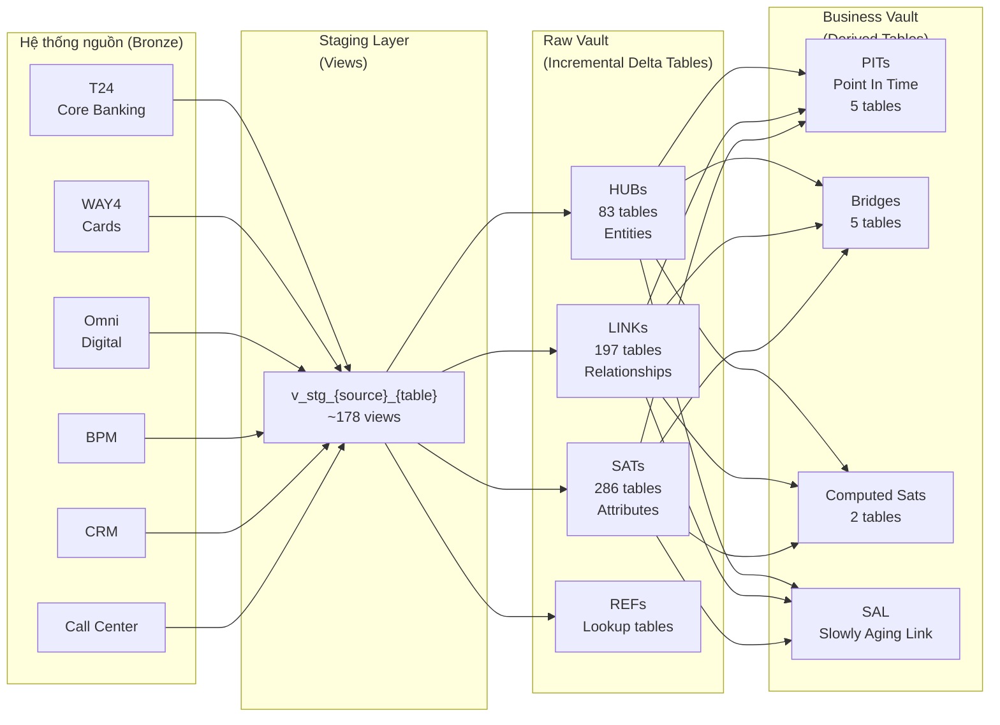
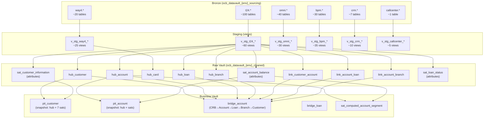

# OCB Data Vault 2.0 — dbt on Databricks

> **Project**: `datavaultmodel2`  
> **Organization**: OCB  
> **Stack**: dbt Core · Databricks (Unity Catalog) · Delta Lake · GitLab CI/CD  

---

## Table of Contents

1. [Project Overview](#1-project-overview)
2. [Architecture Diagram](#2-architecture-diagram)
3. [Prerequisites](#3-prerequisites)
4. [Setup Guide](#4-setup-guide)
5. [Backfill Guide](#5-backfill-guide)
6. [Troubleshooting](#6-troubleshooting)
7. [Data Lineage](#7-data-lineage)

---

## 1. Project Overview

### Mục tiêu

Project này xây dựng một **Data Warehouse chuẩn Data Vault 2.0** cho OCB, nhằm:

- Tích hợp dữ liệu từ **6 hệ thống nguồn** (T24, WAY4, Omni, BPM, CRM, Call Center) về một nền tảng duy nhất.
- Lưu trữ toàn bộ lịch sử thay đổi dữ liệu (no data is ever deleted/overwritten).
- Tách biệt giữa **lưu trữ dữ liệu thô** (Raw Vault) và **logic nghiệp vụ** (Business Vault).
- Hỗ trợ incremental load hàng ngày **và** backfill lịch sử linh hoạt.

### Use Cases

| Domain | Mô tả |
|---|---|
| **Core Banking** | Tài khoản, khoản vay, tiền gửi, ngoại tệ (T24) |
| **Cards** | Thẻ, giao dịch, billing (WAY4) |
| **Digital Banking** | Người dùng, thanh toán, thiết bị (Omni) |
| **BPM** | Workflow nghiệp vụ, hồ sơ, bảo hiểm |
| **CRM** | Lịch sử liên hệ khách hàng, ghi chú |
| **Call Center** | Log cuộc gọi |

### Tech Stack

| Công cụ | Mục đích |
|---|---|
| **dbt Core** | Transformation framework, model orchestration |
| **Databricks** | SQL compute engine (SQL Warehouse) |
| **Delta Lake** | Storage format (ACID, time travel) |
| **Unity Catalog** | Data governance & access control |
| **GitLab CI/CD** | Pipeline deploy Databricks bundle |
| **Databricks Asset Bundles** | Quản lý job definitions dưới dạng code |

### Quy mô

- **823 models** tổng cộng: 178 staging views · 629 raw vault tables · 16 business vault tables
- **17 reusable macros** triển khai chuẩn Data Vault 2.0
- **3 environments**: `dev`, `pilotcloud`, `prod`
- **20 threads** song song khi chạy

---

## 2. Architecture Diagram

### Luồng dữ liệu tổng quát



### Giải thích từng layer

| Layer | Materialization | Mục đích |
|---|---|---|
| **Staging** | `view` | Chuẩn hóa data từ Bronze: cast types, generate hash keys, hashdiff. Luôn đọc data mới nhất. |
| **Raw Vault — Hub** | `incremental (merge)` | Lưu **business keys** của từng entity (customer, account, loan...). Mỗi entity = 1 row, không bao giờ update. |
| **Raw Vault — Link** | `incremental (merge)` | Lưu **quan hệ** giữa các entities. Ví dụ: account ↔ branch, customer ↔ account. |
| **Raw Vault — Satellite** | `incremental (merge)` | Lưu **thuộc tính** của entity/relationship theo thời gian. Mỗi lần thay đổi = 1 row mới (CDC via hashdiff). |
| **Business Vault — PIT** | `incremental (merge)` | Snapshot trạng thái entity tại một thời điểm, join nhiều satellites. |
| **Business Vault — Bridge** | `incremental (merge)` | Multi-hop join across hubs + links, phục vụ reporting. |
| **Business Vault — Computed Sat** | `incremental (merge)` | Thuộc tính tính toán từ business logic (không tồn tại trực tiếp trong source). |

---

## 3. Prerequisites

### Công cụ cần cài

```bash
# Python >= 3.10
python --version

# dbt với adapter Databricks
pip install dbt-databricks

# Databricks CLI (để deploy bundles)
pip install databricks-cli
# hoặc
brew install databricks  # macOS

# Kiểm tra version
dbt --version
databricks --version
```

### Quyền truy cập cần thiết

| Resource | Quyền |
|---|---|
| Databricks Workspace | Can use SQL Warehouse, access Unity Catalog |
| Unity Catalog — Bronze DB | `SELECT` trên `ocb_datavault_{env}_sourcing` |
| Unity Catalog — Raw Vault DB | `CREATE TABLE`, `INSERT`, `SELECT` trên `ocb_datavault_{env}_cleaned` |
| Service Principal | OAuth client_id + client_secret (hỏi infra team) |
| GitLab | Developer role trên repo (để trigger pipeline) |

### Biến môi trường cần thiết

```bash
export DATABRICKS_HOST="https://<workspace>.azuredatabricks.net"
export DATABRICKS_SQL_WAREHOUSE_HTTP_PATH="/sql/1.0/warehouses/<id>"
export DATABRICKS_CLIENT_ID="<service-principal-client-id>"
export DATABRICKS_CLIENT_SECRET="<service-principal-secret>"
export DATABRICKS_DESTINATION_CATALOG="ocb_datavault_dev_cleaned"
export DATABRICKS_DESTINATION_SCHEMA="raw_vault"
```

---

## 4. Setup Guide

### 4.1 Clone repo

```bash
git clone <repository-url>
cd datavault-model
```

### 4.2 Cài dependencies

```bash
pip install -r requirements.txt
# hoặc nếu chỉ cần dbt
pip install dbt-databricks
```

### 4.3 Cấu hình `profiles.yml`

File `profiles.yml` đã có sẵn trong repo. Nó đọc thông tin kết nối từ environment variables (xem mục 3).

```yaml
# profiles.yml (đã có trong repo)
datavault-model:
  target: dev
  outputs:
    dev:
      type: databricks
      host: "{{ env_var('DATABRICKS_HOST') }}"
      http_path: "{{ env_var('DATABRICKS_SQL_WAREHOUSE_HTTP_PATH') }}"
      client_id: "{{ env_var('DATABRICKS_CLIENT_ID') }}"
      client_secret: "{{ env_var('DATABRICKS_CLIENT_SECRET') }}"
      catalog: "{{ env_var('DATABRICKS_DESTINATION_CATALOG') }}"
      schema: "{{ env_var('DATABRICKS_DESTINATION_SCHEMA') }}"
      threads: 20
```

> **Lưu ý**: Không commit credentials vào file này. Dùng `.env` hoặc vault để quản lý secrets.

### 4.4 Kiểm tra kết nối

```bash
dbt debug
```

Kết quả mong đợi: tất cả các check đều `OK`.

### 4.5 Chạy models

#### Chạy toàn bộ pipeline (1 ngày)

```bash
dbt run \
  --vars '{"target_date": "20250415", "run_mode": "daily"}' \
  --target dev
```

#### Chạy theo source tag

```bash
# Chỉ chạy T24
dbt run --select tag:t24 \
  --vars '{"target_date": "20250415", "run_mode": "daily"}'

# Chỉ chạy WAY4
dbt run --select tag:way4 \
  --vars '{"target_date": "20250415", "run_mode": "daily"}'
```

#### Chạy theo layer

```bash
# Chỉ staging
dbt run --select staging.*

# Chỉ raw_vault
dbt run --select raw_vault.*

# Chỉ business_vault
dbt run --select business_vault.*

# 1 model cụ thể
dbt run --select hub_customer \
  --vars '{"target_date": "20250415"}'
```

#### Chạy tests

```bash
dbt test

# Test 1 model
dbt test --select hub_customer
```

#### Build (run + test cùng lúc)

```bash
dbt build \
  --vars '{"target_date": "20250415", "run_mode": "daily"}'
```

### 4.6 Environments

| Target | Dùng khi |
|---|---|
| `dev` | Development & testing cá nhân |
| `pilotcloud` | UAT / staging trước production |
| `prod` | Production |

```bash
# Chạy với target cụ thể
dbt run --target pilotcloud \
  --vars '{"target_date": "20250415"}'
```

---

## 5. Backfill Guide

### 5.1 Cơ chế hoạt động

Mỗi model raw vault sử dụng biến `target_date` (format: `YYYYMMDD`) để lọc dữ liệu theo ngày. Để load lịch sử, bạn chạy lại dbt với từng giá trị `target_date` khác nhau.

```
target_date = '20250101'  → chỉ xử lý data có source_event_date = 20250101
target_date = '20250102'  → chỉ xử lý data có source_event_date = 20250102
...
```

Incremental merge đảm bảo không có duplicate: nếu ngày đó đã load rồi thì chạy lại cũng an toàn.

### 5.2 Backfill thủ công (1 ngày)

```bash
dbt run \
  --vars '{"target_date": "20250101", "run_mode": "backfill"}' \
  --target dev
```

### 5.3 Backfill theo range (script Python)

```bash
# Tạo danh sách ngày backfill
python sourcing/generate_backfill_dates.py \
  --start-date 20250101 \
  --end-date 20250115

# Kết quả: ["20250101", "20250102", ..., "20250115"]
```

#### Shell loop đơn giản (Linux/macOS)

```bash
START_DATE="20250101"
END_DATE="20250115"
CURRENT="$START_DATE"

while [[ "$CURRENT" -le "$END_DATE" ]]; do
  echo "Running for $CURRENT..."
  dbt run \
    --select tag:t24 \
    --vars "{\"target_date\": \"$CURRENT\", \"run_mode\": \"backfill\"}" \
    --target dev
  
  # Tăng ngày lên 1
  CURRENT=$(date -d "$CURRENT + 1 day" +%Y%m%d 2>/dev/null || \
            python3 -c "from datetime import datetime, timedelta; d=datetime.strptime('$CURRENT','%Y%m%d'); print((d+timedelta(1)).strftime('%Y%m%d'))")
done
```

### 5.4 Backfill qua Databricks Job (cách khuyến nghị cho production)

Project có sẵn job definitions trong `resources/`. Các job này dùng `for_each_task` để chạy song song theo từng ngày:

```yaml
# Cấu trúc job backfill (trong resources/pilot_job_t24.yml)
# 1. Task generate_backfill_dates: tạo mảng dates từ start→end
# 2. Task run_t24_history_by_date: chạy dbt cho MỖI ngày song song
```

```bash
# Deploy job lên Databricks (qua GitLab CI hoặc thủ công)
databricks bundle deploy --target dev

# Trigger job backfill
databricks jobs run-now --job-id <job_id> \
  --job-parameters '{"start_date": "2025-01-01", "end_date": "2025-01-31", "run_mode": "backfill"}'
```

### 5.5 Backfill từng source độc lập

```bash
# T24 từ 1/1 đến 31/1
dbt run --select tag:t24 \
  --vars '{"target_date": "20250115", "run_mode": "backfill"}'

# WAY4
dbt run --select tag:way4 \
  --vars '{"target_date": "20250115", "run_mode": "backfill"}'

# Omni
dbt run --select tag:omni \
  --vars '{"target_date": "20250115", "run_mode": "backfill"}'
```

### 5.6 Kiểm tra kết quả backfill

```sql
-- Kiểm tra số records per ngày trong hub
SELECT source_event_date, COUNT(*) as cnt
FROM raw_vault.hub_customer
GROUP BY 1
ORDER BY 1;

-- Kiểm tra satellite có đúng ngày không
SELECT source_event_date, COUNT(*) as cnt
FROM raw_vault.sat_customer_information
GROUP BY 1
ORDER BY 1;
```

---

## 6. Troubleshooting

### 6.1 Lỗi kết nối Databricks

**Triệu chứng:**
```
databricks.sdk.errors.platform.PermissionDenied: ...
```

**Nguyên nhân & cách fix:**
1. **Sai credentials** → Kiểm tra lại `DATABRICKS_CLIENT_ID` và `DATABRICKS_CLIENT_SECRET`
2. **Token hết hạn** → Tạo lại OAuth token hoặc client secret
3. **Sai workspace host** → Verify `DATABRICKS_HOST` (phải có `https://` và không có dấu `/` cuối)

```bash
# Debug kết nối
dbt debug --target dev
```

---

### 6.2 Lỗi Schema Contract

**Triệu chứng:**
```
Compilation Error: Contract enforcement is enabled for model ...
Column "new_column" not found in contract
```

**Nguyên nhân**: Model bật `contract: enforced: true`, nhưng source data có thêm/bớt cột so với schema file.

**Cách fix:**
```yaml
# Cập nhật file schema tương ứng (ví dụ: raw_vault_schema_t24.yml)
# Thêm định nghĩa cột mới:
columns:
  - name: new_column
    data_type: string
    description: "..."
```

---

### 6.3 Lỗi Schema Change trên Incremental Model

**Triệu chứng:**
```
Error: on_schema_change is set to 'fail'. New columns detected.
```

**Nguyên nhân**: Source thêm cột mới, model incremental cấu hình `on_schema_change: fail`.

**Cách fix (chọn 1):**

Option A — Full refresh 1 lần:
```bash
dbt run --select <model_name> --full-refresh
```

Option B — Cập nhật schema file rồi run lại:
```yaml
# Thêm cột mới vào schema yml, sau đó:
dbt run --select <model_name> --full-refresh
```

---

### 6.4 Lỗi Incremental Merge — Duplicate Keys

**Triệu chứng**: Model chạy thành công nhưng có duplicate records trong table.

**Nguyên nhân**: `unique_key` không đủ phân biệt (thường gặp ở satellite: cần cả `hashkey` + `hashdiff`).

**Cách kiểm tra:**
```sql
SELECT hub_hashkey, hashdiff, COUNT(*) as cnt
FROM raw_vault.sat_customer_information
GROUP BY 1, 2
HAVING cnt > 1;
```

**Cách fix**: Full refresh model + kiểm tra lại `unique_key` config.

---

### 6.5 Lỗi target_date không lọc đúng

**Triệu chứng**: Model chạy nhưng không có data mới / load quá nhiều data.

**Kiểm tra:**
```bash
# Xem giá trị target_date đang dùng
dbt compile --select hub_customer \
  --vars '{"target_date": "20250415"}' | grep target_date
```

**Lưu ý**: Format phải là `YYYYMMDD` (8 chữ số, không có dấu `-`):
```bash
# Đúng
--vars '{"target_date": "20250415"}'

# Sai
--vars '{"target_date": "2025-04-15"}'
```

---

### 6.6 Lỗi Permission trên Unity Catalog

**Triệu chứng:**
```
AnalysisException: User does not have CREATE privilege on schema ...
```

**Cách fix**: Yêu cầu Databricks admin cấp quyền:
```sql
-- Admin chạy trên Databricks
GRANT CREATE, USAGE ON SCHEMA ocb_datavault_dev_cleaned.raw_vault 
  TO `<service-principal-id>`;
```

---

### 6.7 Job Backfill bị treo / timeout

**Triệu chứng**: Databricks job chạy quá lâu, không xong.

**Cách xử lý:**
1. Giảm range date (chia nhỏ hơn, VD: từng tuần thay vì cả tháng)
2. Tăng cluster size hoặc dùng SQL Warehouse lớn hơn
3. Chạy từng source tag riêng biệt thay vì full run

```bash
# Thay vì chạy toàn bộ, chạy từng source
dbt run --select tag:t24 --vars '...'
dbt run --select tag:way4 --vars '...'
# etc.
```

---

### 6.8 Lỗi hash_key tạo ra NULL

**Triệu chứng**: `hub_hashkey` hoặc `hashdiff` bị NULL trong table.

**Nguyên nhân**: Các cột input của `hash_key()` macro bị NULL.

**Kiểm tra trong staging view:**
```sql
SELECT *
FROM staging.v_stg_t24_t24_customer
WHERE customer_hashkey IS NULL
LIMIT 10;
```

**Cách fix**: Kiểm tra logic `COALESCE` trong staging model hoặc macro `hash.sql`.

---

## 7. Data Lineage

### 7.1 Luồng dữ liệu chi tiết



### 7.2 Quan hệ Hub — Link — Satellite

```mermaid
erDiagram
    HUB_CUSTOMER {
        string customer_hashkey PK
        string customer_id BK
        date source_event_date
        string record_source
        timestamp load_timestamp
    }

    HUB_ACCOUNT {
        string account_hashkey PK
        string account_number BK
        date source_event_date
        string record_source
        timestamp load_timestamp
    }

    LINK_CUSTOMER_ACCOUNT {
        string link_hashkey PK
        string customer_hashkey FK
        string account_hashkey FK
        date source_event_date
        string record_source
        timestamp load_timestamp
    }

    SAT_CUSTOMER_INFORMATION {
        string customer_hashkey FK
        string hashdiff
        date source_event_date
        string full_name
        string date_of_birth
        string address
        string phone
        timestamp load_timestamp
    }

    SAT_ACCOUNT_BALANCE {
        string account_hashkey FK
        string hashdiff
        date source_event_date
        decimal current_balance
        decimal available_balance
        string currency
        timestamp load_timestamp
    }

    HUB_CUSTOMER ||--o{ LINK_CUSTOMER_ACCOUNT : "has"
    HUB_ACCOUNT ||--o{ LINK_CUSTOMER_ACCOUNT : "belongs to"
    HUB_CUSTOMER ||--o{ SAT_CUSTOMER_INFORMATION : "described by"
    HUB_ACCOUNT ||--o{ SAT_ACCOUNT_BALANCE : "described by"
```

### 7.3 Danh sách Hub entities chính

| Hub | Business Key | Source |
|---|---|---|
| `hub_customer` | customer_id | T24, Omni, CRM |
| `hub_account` | account_number | T24, BPM |
| `hub_loan` | loan_id / contract_id | T24, BPM |
| `hub_card` | card_number | WAY4 |
| `hub_branch` | branch_code | T24 |
| `hub_collateral` | collateral_id | T24, BPM |
| `hub_deposit` | deposit_id | T24 |
| `hub_customer_contact` | contact_id | CRM |

### 7.4 Danh sách Link quan trọng

| Link | Kết nối | Mô tả |
|---|---|---|
| `link_customer_account` | customer ↔ account | Khách hàng sở hữu tài khoản |
| `link_account_loan` | account ↔ loan | Tài khoản liên kết khoản vay |
| `link_account_branch` | account ↔ branch | Tài khoản thuộc chi nhánh |
| `link_crb_account` | CRB ↔ account | Hồ sơ tín dụng |
| `link_account_contract_card` | account ↔ card contract | Thẻ liên kết tài khoản |
| `link_customer_contact_hist` | customer ↔ contact | Lịch sử liên hệ |

### 7.5 Business Vault — Bridge example

`bridge_account` thực hiện multi-hop join:

```
CRB → Account → Loan → Branch → Customer → Account Officer
```

Dùng cho báo cáo cần kết hợp thông tin từ nhiều entity trong 1 query.

### 7.6 Naming Convention

```
# Staging
v_stg_{source}_{table}.sql
# VD: v_stg_t24_t24_customer.sql

# Hub
hub_{entity}.sql
# VD: hub_customer.sql

# Link
link_{entity1}_{entity2}.sql
# VD: link_customer_account.sql

# Satellite
sat_{entity}_{attribute_group}.sql
# VD: sat_customer_information.sql

# Effectivity Satellite
effsat_link_{link_name}.sql

# Point In Time
pit_{entity}.sql

# Bridge
bridge_{entity}.sql

# Computed Satellite
sat_computed_{entity}_{metric}.sql
```

